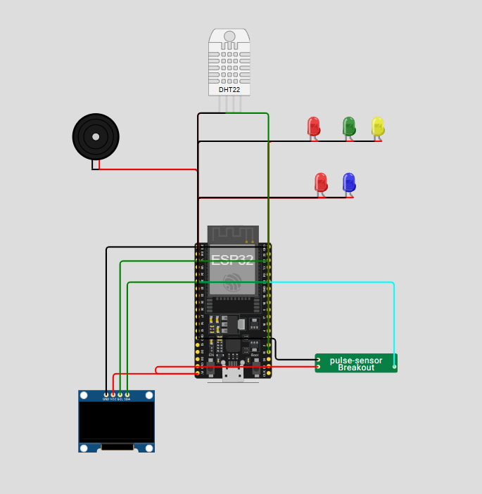

# **💓 Monitoramento de BPM e Temperatura**

Este repositório implementa um sistema de **monitoramento de batimentos cardíacos (BPM) e temperatura ambiente**, utilizando um ESP32, display OLED, sensor de pulso, sensor de temperatura DHT22, LEDs indicadores e buzzer. O sistema exibe em tempo real os valores medidos e envia os dados via MQTT.

---

## 📷 Protótipo

> *Simulação feita no [Wokwi](https://wokwi.com/).*



---

## 🔧 Componentes Utilizados

* **Placa:** ESP32 DevKit C v4 (simulado no Wokwi)
* **Sensores:** 
  * Sensor de batimentos cardíacos
  * Sensor DHT22 (temperatura ambiente)
* **Display:** OLED monocromático I2C 128x64
* **Atuadores:**
  * LEDs para BPM (Baixo, Normal, Alto)
  * LEDs para temperatura (Baixa, Alta)
  * Buzzer piezoelétrico
* **Comunicação:** Wi-Fi + MQTT via `test.mosquitto.org:1883`

---

## ⚙️ Como Funciona

1. **Leitura de BPM**
   * Sensor de pulso lê os batimentos cardíacos.
   * Classificação do ritmo:
     * **Abaixo do normal** → LED vermelho acende + buzzer toca
     * **Normal** → LED verde acende
     * **Alto** → LED vermelho acende + buzzer toca

2. **Leitura de Temperatura**
   * Sensor DHT22 mede a temperatura ambiente.
   * Classificação da temperatura:
     * **Baixa** → LED azul acende
     * **Normal** → sem LED aceso
     * **Alta** → LED vermelho acende

3. **Exibição no Display OLED**
   * Uma seção para BPM:
     * Estado (Abaixo, Normal, Alto)
     * Valor do BPM
   * Linha separadora
   * Uma seção para temperatura:
     * Valor da temperatura em °C
     * Estado (Baixa, Normal, Alta)

4. **MQTT**
   * Publicação em tópicos:
     * `monitor/cardiaco/valor` → BPM
     * `monitor/cardiaco/estado` → Estado do BPM
     * `monitor/temperatura/valor` → Temperatura
     * `monitor/temperatura/estado` → Estado da temperatura
   * Broker: `test.mosquitto.org` porta `1883` via TCP/IP

---

## 📁 Estrutura de Arquivos

```plaintext
├── sketch.ino       # Código principal do projeto
├── diagram.json     # Diagrama do circuito no Wokwi
└── libraries.txt    # Bibliotecas necessárias
```

---

## 🚀 Simulação no Wokwi

1. Acesse [https://wokwi.com](https://wokwi.com)
2. Crie um novo projeto e faça upload de:
   * `sketch.ino`
   * `diagram.json`
   * `libraries.txt`
3. Clique em **Start Simulation**
4. Abra o **Serial Monitor** para observar os dados
5. Observe o **display OLED** e os LEDs para BPM e temperatura

---

## Interfaces e Protocolos

Este projeto utiliza comunicação via protocolo **MQTT**, com os seguintes detalhes:

* **Broker MQTT:** `test.mosquitto.org`
* **Porta:** `1883`
* **Transporte:** TCP/IP
* **Client Library:** PubSubClient para ESP32

### Publicações (ESP32 → Broker)

| Tópico                     | Descrição                                  |
| --------------------------- | ------------------------------------------ |
| `monitor/cardiaco/valor`    | Valor do BPM (batimentos por minuto)      |
| `monitor/cardiaco/estado`   | Estado do BPM (Abaixo, Normal, Alto)      |
| `monitor/temperatura/valor` | Temperatura medida em °C                  |
| `monitor/temperatura/estado`| Estado da temperatura (Baixa, Normal, Alta)|

---

## 🔄 Possíveis Extensões

* Adicionar múltiplos sensores de BPM para diferentes usuários
* Integração com dashboard para monitoramento remoto
* Registro histórico de BPM e temperatura
* Alertas via aplicativo ou notificação MQTT

---

## 📜 Licença

Este projeto está licenciado sob a **MIT License**. Veja o arquivo `LICENSE` para mais detalhes.
